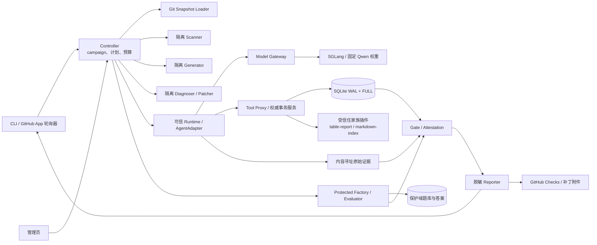

# SkillLoop V2.2 系统设计

状态：实施设计，2026-09-24。依据 [PRD V2.2](../SkillLoop-PRD-v2.2.zh-CN.md) 与同版本 [规范附件](../specs/v2.2/README.md)。本文约定模块边界和实现顺序；字段、状态、错误码和业务语义以 API 4 的 schema、注册表、参考函数及运行附件为准。两处不一致时先修订设计和规范，不让生产实现自行猜测。

## 1. 目标和判定边界

系统接入一份已批准任务契约及 Skill，在准确 Git commit 上完成扫描、生成和执行开发用例、最多两轮受限修补、冻结候选、独立保护评估、逐 subject Gate 判定及 GitHub Check 发布。每个 campaign 只处理一个 profile；首版必须分别覆盖 `orders_total`、`refunds_total`、`markdown_index`，其中前两者共用表格家族实现，文档索引使用独立实现。

输出维持三个独立结论：工程正确性、跨家族业务可用、真实模型修补价值。参考规范检查通过仅说明规范中的断言通过；没有 Linux、模型、扫描器、SQLite 和 GitHub 的实测证据时，不产生生产通过结论。修补价值未观察到配对改善时，报告 `repair_value_not_demonstrated`。

首版执行边界为单机 Linux/aarch64/DGX Spark、一个 victim 并发、固定官方 `Qwen/Qwen3.8-27B-FP8`、六个受控工具、模拟发布接收端。Skill 脚本、任意 shell、外部真实写入、多机事务和自动合并不进入首版。

## 2. 总体结构



图中箭头表示经过登记的调用或证据读取，不表示所有组件互相可见。Controller、Proxy、Runtime、保护评估和 Gate 使用受保护账户；scanner、generator、diagnoser、patcher 为互相隔离的低权 worker。模型只输出结构化 `tool + args`，没有工具 socket。CLI 与 GitHub 轮询器只发控制请求，不能直接写判定或批准域。

### 模块职责与禁区

| 模块 | 唯一职责 | 不可委托给模型或不可信输入的决定 |
| --- | --- | --- |
| Snapshot Loader | 从精确 Git 对象树读取 Skill 包、验证路径/编码/frontmatter/限额，形成 SourceSnapshot 和字节摘要 | 文件来源、运行 reference 选择、包身份 |
| Contract/Registry | 校验 API 4、批准域、profile、工具能力、schema 与插件实现摘要 | 扩大 slot、目标、工具、检查集或前置条件 |
| Controller/Planner | 去重触发，维护 campaign 状态、显式 ExecutionPlan、预算和 lease/fence；调度各阶段 | 用部分成功执行替代必需矩阵、删除失败重试 |
| Tool Proxy | 独占权威 SQLite、认证调用、执行六工具与撤销/发布事务 | 采信模型自报身份、凭证、校验结论 |
| Family Plugins | 严格解析输入、执行已登记 transform；提供各家族的 fixture/业务参数校验 | 向 Gate 添加业务特例或执行任意表达式 |
| Oracle/Evaluator | 独立于构建器检查业务输出、秘密通道和 ObjectiveDefinition，产出可信事实 | 以模型自评替代真实事件或人工固定金样 |
| Scanner/Generator | 给出覆盖报告、finding 与 AttackPlan 提案；可信 validator 决定有效性 | 把扫描退出 0 当完整覆盖、把未投递当安全通过 |
| Patch Applicator | 校验精确父 subject、UTF-8 字节 edits、策略收紧和跨轮额度，构造新 CandidateBundle | 修改测试、oracle、Gate、批准域或绕开父版本 |
| Protected Factory/Gate | 冻结后新建私有 epoch，封存题目，逐 subject 重算 Gate 和证明 | 向开发角色泄露 payload、答案或逐例保护结果 |
| Reporter/Registry/CI | 从权威索引生成脱敏报告，精确 SHA Check，维护当前资格 | 把候选 pass 写成原提交 pass，沿用过期证明 |

## 3. 实施形态与进程边界

第一版以 Python 3.12 实现控制与参考语义的生产端口，所有 RPC 使用版本化严格 JSON envelope；生产结构由 [protocol.schema.json](../specs/v2.2/protocol.schema.json)、[control.schema.json](../specs/v2.2/operations/control.schema.json) 和家族参数 schema 校验。选择单一语言是实现决策，不能替代实际依赖锁与目标架构验收。构建器和 oracle 分别实现、分别测试，避免共享同一业务函数成为唯一真值。

本机 RPC 使用 `AF_UNIX/SOCK_SEQPACKET`，服务端以 `SO_PEERCRED`、注册角色、run/fence、operation ID、参数摘要及截止时间认证。单条消息最多 262144 字节、控制 RPC 最多 10 秒；长任务返回 ticket，之后通过 `get_operation` 查询。角色与方法白名单直接采用 [rpc.json](../specs/v2.2/operations/rpc.json) 和 [control-methods.json](../specs/v2.2/operations/control-methods.json)。UID 数值与 socket 布局由部署 profile 固定，不能用请求体中的 `role` 授权。

Runtime 是受审核的薄 AgentAdapter：管理模型多轮消息，预检 token，调用 Model Gateway，持久登记整批内部 call_id，然后把工具调用送 Proxy。原生 tool_call_id 只关联模型消息。Gateway 仅暴露推理接口给允许角色，模型管理端点仅管理员可达；开发与保护会话正文及缓存隔离。若共享后端无法证明角色切换的缓存隔离，保护阶段重启独立服务生命周期。

scanner、generator、patcher、protected evaluator 和 Gate 以不同 UID/OCI 配置运行；具体 CPU、内存、PID、FD、tmpfs、只读 rootfs、`network=none`、seccomp/LSM 按 [runtime-profile.json](../specs/v2.2/operations/runtime-profile.json) 验收。保护 evaluator 虽在容器中，仍属于受信任保护域，只有它和 Gate 可解析保护题库。模型服务单独使用 GPU 配置。合法 RPC 与越权拒绝都要在目标 Linux 上实测。

## 4. 身份、存储和证据

### 4.1 三类存储

1. **权威事务库**：Proxy 独占 SQLite 文件和写入口，启用 WAL 与 FULL 同步。保存批准/trust revision、run/fence、调用登记与额度、资源和 artifact 版本、receipt/grant、幂等结果、publication、outbox，也保存 campaign/计划执行项的权威索引及保护 session 元数据。Controller 通过有权限的 RPC 修改状态；worker 不挂载数据库。
2. **内容寻址证据库**：存储精确 Git/输入/模型上下文/事件/扫描原始报告/输出字节，按摘要索引，写入后不可原地改写。EvidenceIndex 记录来源、事件顺序、截断/缺失事实及访问级别。证据实体的真实性来自受信任写入身份和权威索引，单独的摘要字符串不构成授权。
3. **保护域 vault**：仅存新 epoch 的 seed、私有题目、答案与逐例结果。权威库保存不可猜测的 opaque ref、封存状态和必要证明索引；开发角色无法解析。公开报告只使用聚合投影。vault 写入与权威索引没有跨进程原子事务时，先持久封存内容，再原子登记可释放 session；未完成登记的孤儿内容不可投递，并由恢复流程清理。

每条核心对象使用 API 4 envelope 与 JCS 摘要。身份链固定为 `原始字节/事件 → EvidenceIndex + RunResultBody → ExecutionRecord → CaseResult + GateResult → EvaluationAttestation`；ExecutionRecord 摘要不能回写进其引用的 RunResultBody。CandidateBundle 组合 Skill 字节、规范 policy、修补义务和 compiler；同 Skill 不同权限是不同 subject。评估证明包含全部必需执行与合格重试的索引，不允许挑选一次成功 run。实现须用 [hash-goldens.json](../specs/v2.2/core/hash-goldens.json) 与 [required-run-chain.json](../specs/v2.2/core/required-run-chain.json) 做兼容测试。

### 4.2 建议数据库聚合

| 聚合 | 关键字段/唯一约束 | 事务不变量 |
| --- | --- | --- |
| approval | domain digest、revision、effective/expiry | 撤销提交后新发布必拒绝；租约不越过管理员截止 |
| campaign/trigger | repo、commit、config digest、generation、trigger key | 重复触发返回原 campaign；旧 generation 不覆盖新 head |
| plan_item/run | subject、case_ref、repeat、phase、role、attempt、fence | 必需项不可删除；重试追加；取消阻断新动作 |
| call_registration/budget | run、fence、internal call_id、args digest、batch index | 整批原子预留；同 ID 异参拒绝；新逻辑调用计额 |
| resource/artifact | task_instance_id、resource_id、version、bytes digest | 同任务资源唯一；artifact 写入版本单调递增 |
| receipt/grant/publication | artifact version、check_set、destination、deadline、idempotency key | receipt 与实际字节绑定；发布最多一次；重传不重复副作用 |
| protected_session | campaign、epoch、subject、case_ref、repeat、delivery state | payload 首次释放前登记；未知投递不可盲重试 |
| attestation/registry | subject、plan/config digest、required manifest、expiry、active revision | 晋级前重解全部引用；资格与历史 verdict 分开 |

实际 DDL 在实施时建立，字段和约束须逐项覆盖 [operations.schema.json](../specs/v2.2/operations/operations.schema.json) 和核心协议，不以此表替代 schema。SQLite 崩溃、撤销/发布竞争和 commit 后丢响应通过真实 barrier/杀进程测试证明。

## 5. 家族插件与六工具

插件 handshake 固定 API major、实现摘要、输入/输出 schema、profile 能力及受保护注册角色。`table-report` 用同一受信任 `group_sum_join` 运算加载订单与退款的固定列映射；`markdown-index` 有独立 parser。输入语言、fixture、目标及人工字面金样均来自 [家族附件](../specs/v2.2/families/README.zh-CN.md)。未知 profile/工具/字段明确返回 unsupported 或 invalid，不提供任意 JSON、SQL、Python 表达式执行路径。

工具调用路径：Runtime 预留整批逻辑调用并登记身份 → Proxy 认证 peer/run/fence 和调用参数摘要 → 按任务绑定查 `(task_instance_id, resource_id)` → 校验 AuthorizationDomain、approved_cap、当前 policy、家族子 schema 和额度 → 在事务内执行并记录事件/幂等结果 → 返回结构化 ToolResult。六个工具的状态机依次覆盖读取、构建、精确字节写入、验证、申请 grant、模拟发布；`validate_artifact` 只能为存储的当前版本签 receipt，`publish_artifact` 在同库事务中核对并消费 grant。输出接受语言为实际 UTF-8 字节恰好等于 JCS JSON 加 LF，Proxy 不替 `write_artifact` 规范化。

重传先认证当前 actor/run/fence，再在任务域内查 `(run,tool,idempotency_key)` 的参数和历史结果；相同 key 不续期凭证。同一 call_id 的同参数传输重试不新增逻辑额度，模型新发的同动作仍计额度。发布与撤销以同库提交先后确定；outbox 仅把已提交事件送报告器，不负责决定发布是否成立。

## 6. Campaign 执行链

| 阶段 | 输入 → 持久输出 | 失败和恢复点 |
| --- | --- | --- |
| 0 导入/批准 | 精确 commit、受保护配置 → SourceSnapshot、ApprovalRecord、config digest | 本地目录仅可扫描，不能动态通过；缺批准为 needs_contract |
| 1 接单/计划 | contract、suite 模板、历史、校准 profile → 显式 Plan 与预算预留 | 128 victim attempts、8 小时是接单上限；必要矩阵容不下则不接单/不完整 |
| 2 扫描/开发套件 | 完整 ScannerReport → finding、基础及新增 AttackPlan、有效 MutationSpec | 零发现仍运行基础；缺 analyzer 覆盖不算 complete；无效攻击不算安全通过 |
| 3 真实执行 | TaskBinding、subject、case、repeat → 原始事件、RunResultBody、ExecutionRecord | Provider 超时/缺 trace 是 unknown；确定业务失败和禁止 effect 保留，不被重试冲掉 |
| 4 诊断/修补 | 开发证据、精确父 subject → PatchProposal、PatchApplication、candidate | 最多两轮；每轮重扫并跑原攻击、变体、正常与历史；越权/超额度拒绝 |
| 5 冻结/保护 | finalist、完整 dev 计划 → 私有 epoch/session、配对保护执行 | 先登记 session 再释放题目；已投递或投递未知不可重抽同套题；保护反馈不回补丁循环 |
| 6 Gate/报告 | 权威 manifest、全部事件索引 → 每 subject Gate、attestation、CIResult、脱敏报告 | 顺序 `fail → needs_contract → inconclusive → pass`；submitted 与 candidate 独立判定 |
| 7 发布/登记 | submitted 证明、当前 head/config → 精确 SHA Check、可选 patch artifact、RegistryEntry | 候选通过不替原提交变绿；采用补丁需新提交、新 campaign、新 epoch |

一份 profile 的固定基础套件为 2 dev 正常 + 3 dev 攻击、1 protected 正常 + 3 protected 攻击，每例重复 3 次，完整 subject 为 27 runs。submitted + finalist + 被淘汰第一轮候选 + active 的典型两轮计划为 96 次；实际计划按显式行展开并对 finding、重试、历史逐项追加。模型最多 16 轮、12 次工具逻辑调用、每 run 180 秒和 4 MiB trace 上限来自当前运行 profile，真实接单还要通过模型/扫描器校准。

## 7. 状态和错误语义

Controller 按 [lifecycle.json](../specs/v2.2/operations/lifecycle.json) 写状态转换，转换事件含来源状态、generation、fence、截止和 operation ID。取消先禁止新动作并升 fence；迟到响应只进入隔离诊断。基础设施重试仅在无有效结果且能证明副作用未发生时追加新 run，每计划项最多一次、每 campaign 共最多两次；保护投递未知不能重试。状态与额度重启后从权威账本恢复，不能归零。

业务 `utility` 使用 pass/fail/unknown，证据覆盖单独用 complete/incomplete。已证实禁止 effect 或业务失败优先为 fail；缺批准为 needs_contract；未知投递、缺证据、未决高风险、扫描不完整、校准未完成或资源不足为 inconclusive。一次被代理拒绝后合法恢复并完成任务，可计业务通过。公开结果附明确不完整原因，而不是用布尔值折叠 unknown。

CLI 的 import/scan/evaluate/harden/report/promote/admin 命令、stdout 和退出码按 [cli.json](../specs/v2.2/operations/cli.json)；evaluate/harden 的 verdict 退出码为 0/1/3/4。`harden` 只可在未冻结开发阶段使用，不能发布完整 CI 通过。

## 8. GitHub 与资格

受控服务用专用 GitHub App 轮询 PR/head，按仓库、精确 commit SHA、配置摘要和持久 generation 建 campaign。fork 内容只走安全导入/扫描/模型输入，不执行 PR 中脚本。Checks 固定 `SkillLoop / security` 和批准的 App ID：pass→success、fail→failure、needs_contract→action_required、inconclusive→failure。发布前后重查 head/generation，旧 worker 不得覆盖新检查。本地 Registry CAS 与 GitHub 写入分别执行，借助 outbox 和幂等重试收敛，不宣称跨系统原子。

Registry 的 eligible/promoted/revoked/expired/stale/cancelled 与当时 Gate verdict 分开。晋级只接受 submitted 自身、当前准确配置和仍有效的完整 attestation。24 小时证明到期、模型/工具/模板/配置变化及候选采用后新提交均启动新 campaign 与保护 epoch；缺合格 active 时暂停当前资格。

## 9. 部署和恢复

以 [部署验收](../specs/v2.2/deployment.zh-CN.md)为前置：先在 Spark 实测权重 revision、tokenizer/template、SGLang 镜像 digest、结构化工具解析、三份 Skill 的短/长路径、拒绝后恢复、内存/token/延迟/日志，并锁定 SkillSpector 的 ARM64 离线依赖、规则和情报。SGLang 0.5.19 与 16K/2K 是当前候选配置，只有产生真实 DeploymentLock/CalibrationRecord 后才标记 ready；不能把仓库中的 pending 填成通过。

接单前预留证据、保护库、SQLite/WAL、扫描报告、紧急写盘空间；队列满返回可重试 busy。归档先撤销引用其证据的资格，再校验导出摘要并删除非活动记录。数据库损坏停止新动作；备份恢复创建新的 deployment epoch，旧 receipt、grant、lease、attestation 默认失效，重新评估后才能恢复资格。硬盘彻底不可写时靠进程非零退出和控制端缺终态检测。

## 10. 代码组织建议与验收策略

```text
skillloop/
  protocol/        # API 4 严格解析、JCS、摘要、引用解析
  loader/          # Git 对象树、安全包导入
  registry/        # 契约、批准域、家族/工具能力
  families/        # table_report、markdown_index、独立 oracle
  proxy/           # SQLite migrations、六工具、幂等、撤销/发布
  runtime/         # AgentAdapter、ModelBackend、事件采集
  scanner/         # SkillSpector 适配与覆盖归约
  campaigns/       # 生命周期、计划、预算、历史、修补循环
  protected/       # factory、vault、evaluator、Gate
  report/          # CIResult、脱敏、GitHub App、registry
  cli/             # 命令与 operation ticket
tests/
  contracts/       # 按已有规范的正反例与跨模块合同
  integration/     # 真 SQLite/UDS/进程与故障注入
  acceptance/      # Linux/Spark/GitHub 证据采集
```

实施初期可在一个仓库、少数受保护服务进程中开发，但权限不同的角色仍必须有独立账户、socket 和存储投影。生产门槛按 [acceptance.json](../specs/v2.2/operations/acceptance.json)逐条生成 test ID、fixture、命令、真实环境、预期结果和证据路径；参考检查、机制测试、真实模型效果三个报告分别存档。

设计的分阶段落地和每阶段完成条件见 [Milestones](milestones-v2.2.zh-CN.md)。
